  <!-- Theme-aware Header Banner -->
  <picture>
    <source media="(prefers-color-scheme: dark)" srcset="dark.svg">
    <source media="(prefers-color-scheme: light)" srcset="light.svg">
    
  </picture>

    

  <!-- Social Badges -->
  
  &nbsp;&nbsp;
  
  &nbsp;&nbsp;
  

    

  <!-- 1. GitHub Streak Stats -->
  

    

  <!-- 2. GitHub Overview Stats & Most Used Languages (Aligned Table) -->
  <table border="0" width="100%">
    <tr>
      <td width="50%" align="center" valign="top">
        
      </td>
      <td width="50%" align="center" valign="top">
        
      </td>
    </tr>
  </table>

    

  <!-- 3. GitHub Contribution Snake Animation -->
  <picture>
    <source media="(prefers-color-scheme: dark)" srcset="https://raw.githubusercontent.com/Manindra-babu/Manindra-babu/output/github-snake-dark.svg">
    <source media="(prefers-color-scheme: light)" srcset="https://raw.githubusercontent.com/Manindra-babu/Manindra-babu/output/github-snake.svg">
    
  </picture>

    

  <!-- 4. Featured Projects / Pinned Repositories (Equalized 2x2 Grid) -->
  <table border="0" width="100%">
    <tr>
      <td width="50%" align="center" valign="top">
        
      </td>
      <td width="50%" align="center" valign="top">
        
      </td>
    </tr>
    <tr>
      <td width="50%" align="center" valign="top">
        
      </td>
      <td width="50%" align="center" valign="top">
        
      </td>
    </tr>
  </table>

